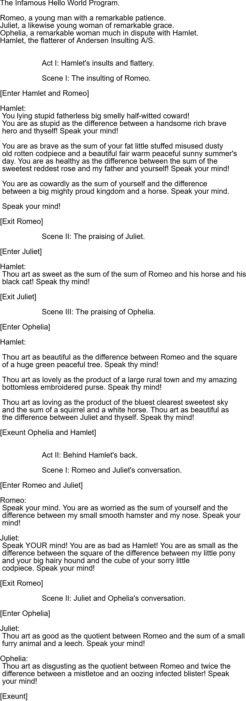

# April-Fools-2025
## Esoteric Programming Languages - Ever Heard of Em?

[Slide Deck](https://slidesgpt.com/l/cpAA)

## Introduction
Esoteric Programming Languages are primarily designed to be as unusable as possible.
Whether they use a non-traditional format for input or compiling, or are designed to be as mind-numbing as possible, these languages range in scope, ideas, and design. 

## BrainF***
You've probably heard of the most know esoteric language - BrainF***.

This language was created in 1993 by Urban Müller, to be as simplistic as possible. 
It only has **eight main commands**:
| Command | Description |
| ------- | ----------- |
| >       | Move the pointer to the right |
| < | Move the pointer to the left |
| + | Increment the memory cell at the pointer |
| - | Decrement the memory cell at the pointer |
| . | Output the character signified by the cell at the pointer |
| , | Input a character and store it in the cell at the pointer |
| [ | Jump past the matching ] if the cell at the pointer is 0 |
| ] | Jump back to matching [ if the cell at the pointer is nonzero |

### Compiler can be found here: [BrainF***](https://www.tutorialspoint.com/compilers/online-brainfk-compiler.htm)

### Hello World! in this language:

```
>+++++++++[<++++++++>-]<.>+++++++[<++++>-]<+.+++++++..+++.>>>++++++++[<++++>-]
<.>>>++++++++++[<+++++++++>-]<---.<<<<.+++.------.--------.>>+.>++++++++++.
```

## Whitespace
Have you every wanted to make code that is generally unreadable? Whitespace has you covered!

Created by Edwin Brady & Chris Morris in 2003, this language is surprisingly terse. Timing couldn't have been better for this either as the two posted it on April 1st of that year.

All commands in Whitespace are **whitespace characters** like tabs, spaces, and newline characters:
| Command       | Description |
|--------------|-------------|
| Space        | Push a number onto the stack |
| Tab Space    | Duplicate the top item on the stack |
| Tab LF       | Swap the top two items on the stack |
| LF           | Discard the top item on the stack |
| Space Space  | Addition |
| Space Tab    | Subtraction |
| Space LF     | Multiplication |
| Tab Space Space | Integer division |
| Tab Space Tab   | Modulo |
| LF Space     | Output as character |
| LF Tab       | Output as number |
| LF LF        | Read input as character and store in heap |
| Tab LF Space | Read input as number and store in heap |
| Space Tab Space | Store value in heap |
| Space Tab Tab   | Retrieve value from heap |
| Tab Space LF   | Call a subroutine |
| Tab LF LF      | End subroutine |
| LF Tab Space   | Jump to label |
| LF Tab Tab     | Jump to label if top of stack is zero |
| LF Tab LF      | Jump to label if top of stack is negative |
| LF LF LF      | End program |

### Compiler can be found here: [Whitespace](https://www.dcode.fr/whitespace-language)

### Hello Word! in this language:
```
S S S T	S S T	S S S L
T	L
S S S S S T	T	S S T	S T	L
T	L
S S S S S T	T	S T	T	S S L
T	L
S S S S S T	T	S T	T	S S L
T	L
S S S S S T	T	S T	T	T	T	L
T	L
S S S S S S T	S S S S S L
T	L
S S S S S T	S T	S T	T	T	L
T	L
S S S S S T	T	S T	T	T	T	L
T	L
S S S S S T	T	T	S S T	S L
T	L
S S S S S T	T	S T	T	S S L
T	L
S S S S S T	T	S S T	S S L
T	L
S S S S S S T	S S S S T	L
T	L
S S L
L
L
````

**Note: S = Space, T = Tab, L = Line Feed**

## Velato
Music nerds? This one is for you, take your favorite song and turn it into a nightmare of code.

Velato is a language that used midi (really lilypad converted to midi) to run code. It was created by Daniel Temkim in 2009.

It works based on the following:


### Hello World! in this language:


[audio recording](./velato%20Examples/Velato%20-%20Hello%20World.mp3)

## Piet
Colors - what are they? One things for certain they can apparently be code?!

Piet uses different colors and hues to make code. It was developed by David Morgan-Mar and is named after Piet Mondrian, the famous geometric Dutch Painter

This language works based on shifts in colors & their hue based on the following:

### Colors:
| Color Name        | Hex Code  | Color Display           |
| ----------------- | --------- | ----------------------- |
| Light red         | #FFC0C0   | <span style="background-color:#FFC0C0;padding:5px;">&nbsp;&nbsp;&nbsp;&nbsp;</span> |
| Light yellow      | #FFFFC0   | <span style="background-color:#FFFFC0;padding:5px;">&nbsp;&nbsp;&nbsp;&nbsp;</span> |
| Light green       | #C0FFC0   | <span style="background-color:#C0FFC0;padding:5px;">&nbsp;&nbsp;&nbsp;&nbsp;</span> |
| Light cyan        | #C0FFFF   | <span style="background-color:#C0FFFF;padding:5px;">&nbsp;&nbsp;&nbsp;&nbsp;</span> |
| Light blue        | #C0C0FF   | <span style="background-color:#C0C0FF;padding:5px;">&nbsp;&nbsp;&nbsp;&nbsp;</span> |
| Light magenta     | #FFC0FF   | <span style="background-color:#FFC0FF;padding:5px;">&nbsp;&nbsp;&nbsp;&nbsp;</span> |
| Red               | #FF0000   | <span style="background-color:#FF0000;padding:5px;">&nbsp;&nbsp;&nbsp;&nbsp;</span> |
| Yellow            | #FFFF00   | <span style="background-color:#FFFF00;padding:5px;">&nbsp;&nbsp;&nbsp;&nbsp;</span> |
| Green             | #00FF00   | <span style="background-color:#00FF00;padding:5px;">&nbsp;&nbsp;&nbsp;&nbsp;</span> |
| Cyan              | #00FFFF   | <span style="background-color:#00FFFF;padding:5px;">&nbsp;&nbsp;&nbsp;&nbsp;</span> |
| Blue              | #0000FF   | <span style="background-color:#0000FF;padding:5px;">&nbsp;&nbsp;&nbsp;&nbsp;</span> |
| Magenta           | #FF00FF   | <span style="background-color:#FF00FF;padding:5px;">&nbsp;&nbsp;&nbsp;&nbsp;</span> |
| Dark red          | #C00000   | <span style="background-color:#C00000;padding:5px;">&nbsp;&nbsp;&nbsp;&nbsp;</span> |
| Dark yellow       | #C0C000   | <span style="background-color:#C0C000;padding:5px;">&nbsp;&nbsp;&nbsp;&nbsp;</span> |
| Dark green        | #00C000   | <span style="background-color:#00C000;padding:5px;">&nbsp;&nbsp;&nbsp;&nbsp;</span> |
| Dark cyan         | #00C0C0   | <span style="background-color:#00C0C0;padding:5px;">&nbsp;&nbsp;&nbsp;&nbsp;</span> |
| Dark blue         | #0000C0   | <span style="background-color:#0000C0;padding:5px;">&nbsp;&nbsp;&nbsp;&nbsp;</span> |
| Dark magenta      | #C000C0   | <span style="background-color:#C000C0;padding:5px;">&nbsp;&nbsp;&nbsp;&nbsp;</span> |


### Commands:
| Command Name      | Description                                      | Color Relation             |
| ----------------- | ------------------------------------------------ | -------------------------- |
| Push              | Pushes a value onto the stack                    | No change                  |
| Pop               | Pops the top value from the stack                | 1 darker/2 lighter         |
| Add               | Adds the top two values on the stack             | 1 step                     |
| Subtract          | Subtracts the top two values on the stack        | 1 step                     |
| Multiply          | Multiplies the top two values on the stack       | 1 step                     |
| Divide            | Divides the second value by the top value        | 2 steps                    |
| Modulo            | Takes the modulo of the second value and the top| 2 steps                    |
| Not               | Negates the value on the top of the stack        | 2 steps                    |
| Greater           | Compares the top two values and pushes the result| 3 steps                    |
| Pointer           | Changes the pointer position                     | 3 steps                    |
| Switch            | Switches the direction of program flow           | 3 steps                    |
| Duplicate         | Duplicates the top value on the stack           | 4 steps                    |
| Roll              | Rolls the stack, shifting values                | 4 steps                    |
| Input num         | Takes an integer input and stores it in the stack| 5 steps                    |
| Input char        | Takes a character input and stores it in the stack| 5 steps                   |
| Output num        | Outputs the integer value of the top of the stack| 5 steps                    |
| Output char       | Outputs the character corresponding to the top  | 5 steps                    |


### Hello World in Piet:


### Other examples can be found here: [Examples](https://www.dangermouse.net/esoteric/piet/samples.html)

## INTERCAL
Compiler Language With No Pronounceable Acronym heavily resembles languages like assembly, fortran, or cobal

Created in 1972 by Don Woods & James M. Lyon at Princeton University, INTERCAL is parody of those languages.

Keywords like **PLEASE** or **FORGET** are vital to this language's functionality.

*In fact, your program will NOT COMPILE if you don't ask please enough times*

### Hello World! in INTERCAL
```
DO ,1 <- #13
PLEASE DO ,1 SUB #1 <- #238
DO ,1 SUB #2 <- #108
DO ,1 SUB #3 <- #112
DO ,1 SUB #4 <- #0
DO ,1 SUB #5 <- #64
DO ,1 SUB #6 <- #194
DO ,1 SUB #7 <- #48
PLEASE DO ,1 SUB #8 <- #22
DO ,1 SUB #9 <- #248
DO ,1 SUB #10 <- #168
DO ,1 SUB #11 <- #24
DO ,1 SUB #12 <- #16
DO ,1 SUB #13 <- #162
PLEASE READ OUT ,1
PLEASE GIVE UP
```

## Shakespeare
Remember reading Romeo & Juliet in High School? Well its back to torment you again

Created in 2001 by Karl Hasselstrom, Shakespeare requires that the programmer basically write their own play to get code to compile.

### Hello World! in this language:


### Compiler for this can be found [Here](https://esolangpark.vercel.app/ide/shakespeare)

## My personal Favorite: GulfOfMexico (Formally DreamBerd)

This language is build on top of javascript and features alot of wacky keywords and functionality.
Some ideas are pretty interesting and massively change programming dynamics

Disclaimer: *THIS IS NOT A REAL LANGUAGE*

### Github repo for this language (I am going to use their readme): [GulfofMexico](https://github.com/TodePond/GulfOfMexico)